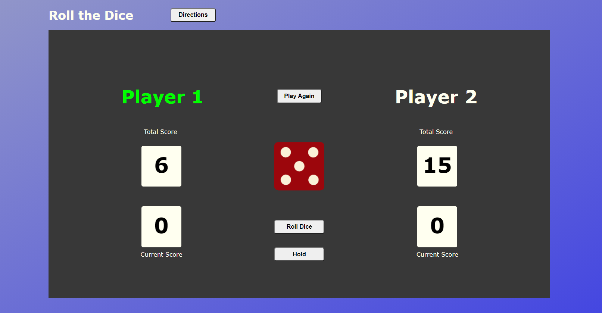

# Dice-Game
Roll the dice until a predefined score is met.
Each player has the option to hold their current score.
If a player rolls a "1", that player loses their turn and current accumalated score.
#### https://devindiego.github.io/Dice-Game/

